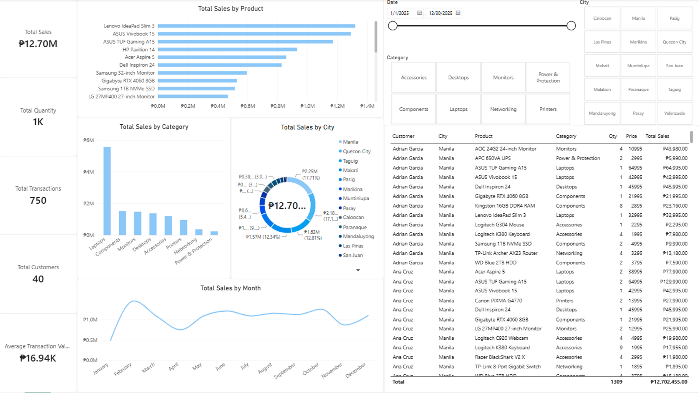

# Sales Performance Analysis Dashboard

### TESDA Data Analytics Level III Final Hands-On Assessment | Power BI



## Project Overview

This project is a **Sales Performance Analysis Dashboard** developed as part of my final hands-on assessment for **TESDA Data Analytics Level III**.

The dashboard was created using **Power BI** to transform customer, product, and sales data into an interactive report that allows users to examine sales performance across products, categories, cities, and time periods.

Beyond presenting overall sales figures, the dashboard uses interactive filters to answer more targeted **business questions** and demonstrate how different dimensions of the data can be analyzed together.

---

## Business Objective

The objective of this project is to analyze sales performance and provide management with insights that can support decisions regarding:

* Product performance
* Category performance
* Customer locations
* Sales trends over time
* Product demand
* Sales performance under different market conditions

The dashboard allows users to interactively filter the data by:

* **Date**
* **Category**
* **City**

These filters can be combined to perform more specific analysis rather than relying only on overall totals.

---

## Dataset

The assessment dataset consists of three related tables.

### Customers

| Column     | Description                                          |
| ---------- | ---------------------------------------------------- |
| `ID`       | Unique customer identifier                           |
| `Customer` | Customer's complete name                             |
| `City`     | Customer's city of residence within NCR, Philippines |

### Products

| Column     | Description               |
| ---------- | ------------------------- |
| `ID`       | Unique product identifier |
| `Product`  | Product name              |
| `Category` | Product category          |
| `Price`    | Product price             |

### Sales

| Column       | Description                             |
| ------------ | --------------------------------------- |
| `SaleID`     | Unique transaction identifier           |
| `CustomerID` | Identifier matching the Customers table |
| `ProductID`  | Identifier matching the Products table  |
| `Date`       | Date of transaction                     |
| `Quantity`   | Quantity purchased                      |

---

## Data Model

The three tables were related using their corresponding identifier fields.

```text
Customers
    │
    │ Customer ID
    ▼
  Sales
    │
    │ Product ID
    ▼
Products
```

This structure allows customer and product information to be analyzed together with sales transactions.

---

## Data Preparation

Before creating the dashboard, the datasets were reviewed and prepared for analysis.

The preparation process included:

* Checking the structure and fields of each dataset
* Checking for duplicate records
* Verifying customer and product identifiers
* Ensuring relationships between tables were properly established
* Reviewing data types
* Importing the prepared datasets into Power BI
* Creating the required calculations and measures

### Synthetic Data Disclosure

The original assessment dataset contained a relatively small number of records. For portfolio purposes, the dataset was expanded using **synthetic records** while preserving the original table structures and relationships.

The expanded data is synthetic and does not represent actual customer or business records.

---

## Key Measures

The following measures were created in Power BI:

* **Average Transaction Value**
* **Total Customers**
* **Total Quantity**
* **Total Sales**
* **Total Transactions**

These measures provide the key performance indicators used throughout the dashboard.

---

## Dashboard Components

The dashboard contains the following visualizations.

### KPI Cards

* Total Sales
* Total Quantity
* Total Transactions
* Total Customers
* Average Transaction Value

### Charts

* **Total Sales by Product** — Clustered bar chart
* **Total Sales by Category** — Clustered column chart
* **Total Sales by City** — Donut chart
* **Total Sales by Month** — Line chart

### Detailed Sales Table

The table provides transaction-level information including:

* Customer
* City
* Product
* Category
* Quantity
* Price
* Total Sales

### Interactive Filters

Users can filter the dashboard using:

* Date
* Category
* City

These slicers allow different combinations of filters to be applied for more targeted analysis.

---

# 🔎 Interactive Business Analysis

Rather than only identifying the overall best-performing product, category, or city, the dashboard can be used to investigate more specific business scenarios by combining multiple filters.

The following questions were designed to demonstrate the use of the dashboard's interactive filtering capabilities.

---

### Question 1 — Product Performance Within a Category

**What are the top three products by total sales in Makati within the Laptops category?**

**Filters to apply:**

* City → Makati
* Category → Laptops

**Answer:**
The top three selling Laptops in Makati are the Lenovo IdeaPad Slim 3, the ASUS TUF Gaming A15, and the ASUS Vivobook 15.

**Screenshot:** `screenshots/q1_city_category.png`

---

### Question 2 — Category Performance Within a City and Period

**Which category generated the highest total sales in Caloocan during January 2025 to June 2025?**

**Filters to apply:**

* City → Caloocan
* Date → 1/1/2025 to 6/30/2025

**Answer:**
`[Enter your finding here.]`

📸 **Screenshot:** `screenshots/q2_city_period.png`

---

### Question 3 — Product Performance Within a City, Category, and Period

**Which product generated the highest total sales in Malabon within the Desktops category during July 2025 to December 2025?**

**Filters to apply:**

* City → Malabon
* Category → Desktops
* Date → 7/1/2025 to 12/31/2025

**Answer:**
`[Enter your finding here.]`

📸 **Screenshot:** `screenshots/q3_city_category_period.png`

---

### Question 4 — Quantity vs. Sales

**Within Manila and the Accessories category, which product had the highest quantity sold, and did it also generate the highest total sales?**

**Filters to apply:**

* City → Manila
* Category → Accessories

**Answer:**
`[Enter your finding here.]`

📸 **Screenshot:** `screenshots/q4_quantity_vs_sales.png`

This question is useful because the product with the highest **quantity sold** does not necessarily have the highest **sales revenue**.

---

### Question 5 — Monthly Performance Within a Specific Market

**During which month did Desktops generate its highest total sales in Muntinlupa?**

**Filters to apply:**

* City → Muntinlupa
* Category → Desktops

**Answer:**
`[Enter your finding here.]`

📸 **Screenshot:** `screenshots/q5_monthly_performance.png`

---

## 💡 Key Business Insight

Based on the interactive analysis, one important business insight identified from the dashboard is:

> **[Write one significant finding from your analysis here.]**

For example, the analysis may reveal that a particular product performs especially well in one city or category despite having a different overall ranking when all sales are considered.

---

## ⚠️ Analytical Limitation

The dataset contains sales and product prices, but it does not contain information such as:

* Cost of goods sold
* Operating expenses
* Profit margins
* Inventory levels
* Customer demographics
* Marketing expenses

Therefore, **high sales do not necessarily mean high profitability**.

Additional information about costs and margins would be required to perform a proper profitability analysis.

---

## 🛠️ Tools & Skills

### Tools

* Microsoft Power BI
* Microsoft Excel / CSV
* SQL

### Skills Demonstrated

* Data preparation and validation
* Data modeling
* Table relationships
* DAX measures
* Data visualization
* Interactive dashboard development
* Filtering and drill-down analysis
* Business question formulation
* Data interpretation
* Business insight generation

---

## 📁 Repository Structure

```text
TESDA-PowerBI-Sales-Analysis/
│
├── README.md
│
├── data/
│   ├── Customers.csv
│   ├── Products.csv
│   └── Sales.csv
│
├── powerbi/
│   └── TESDA_Sales_Dashboard.pbix
│
└── screenshots/
    ├── dashboard.png
    ├── q1_city_category.png
    ├── q2_city_period.png
    ├── q3_city_category_period.png
    ├── q4_quantity_vs_sales.png
    └── q5_monthly_performance.png
```

---

## 🖥️ Dashboard Preview

The main dashboard provides an overview of sales performance while allowing users to interactively filter the results.


The additional screenshots in this repository demonstrate how the dashboard was used to answer targeted business questions through different combinations of filters.

---

## 📚 Project Context

This project was completed as part of my **TESDA Data Analytics training and final hands-on assessment**.

It represents an early project in my transition toward a career in **data analytics**, with a focus on developing practical skills in data preparation, visualization, business analysis, and dashboard development.

---

## 👤 About Me

I am an educator with experience in teaching science, research, statistics, and quantitative analysis. I am currently expanding my technical skills in **data analytics and business intelligence**, with a focus on Power BI, SQL, Excel, and eventually Python.

This project is part of my growing portfolio of practical data analytics work.

---

## 📬 Contact

**Name:** Marvic Kaizz
**GitHub:** [Add your GitHub profile link]
**LinkedIn:** [Add your LinkedIn profile link]
